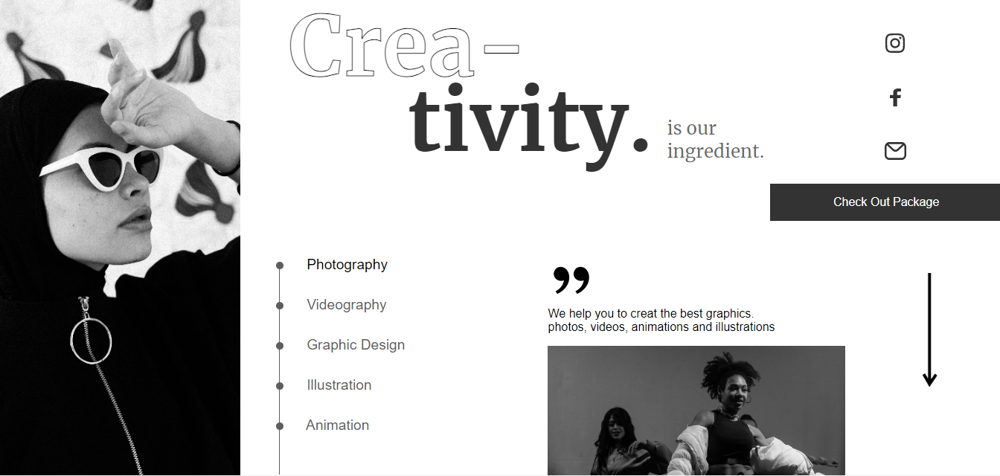

# Project-14 Creativity

## This is created by me.(Mo Ansar Mansoorie)

[Link of live project for view](https://creativitypage.netlify.app/)

# What I learned from this project.

- This project is helpful to understand the concept of flexbox.
- This project is helpful to understand the concept of grid.
- This project is helpful to understand the concept of box-shadow.
- This project is helpful to create nav bar.
- It Is also helpful to understand the basic concept of svg.

# Howmany Time will be consumed to making this project.

- This project have taken 4 hours to complete this project.